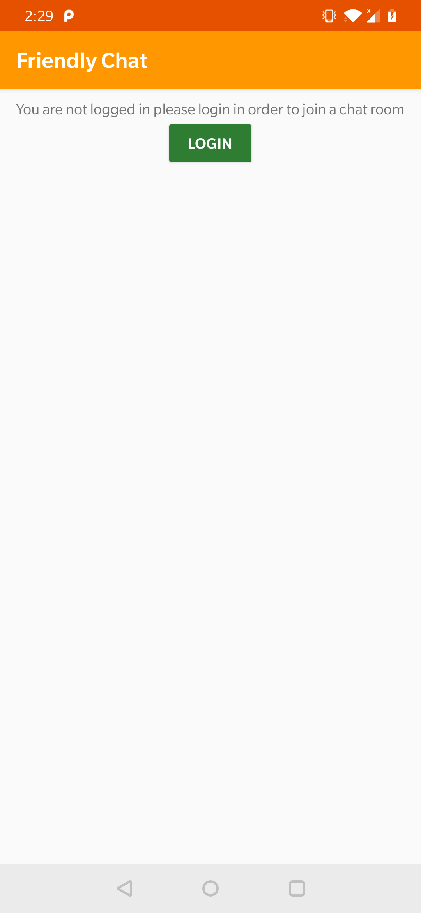
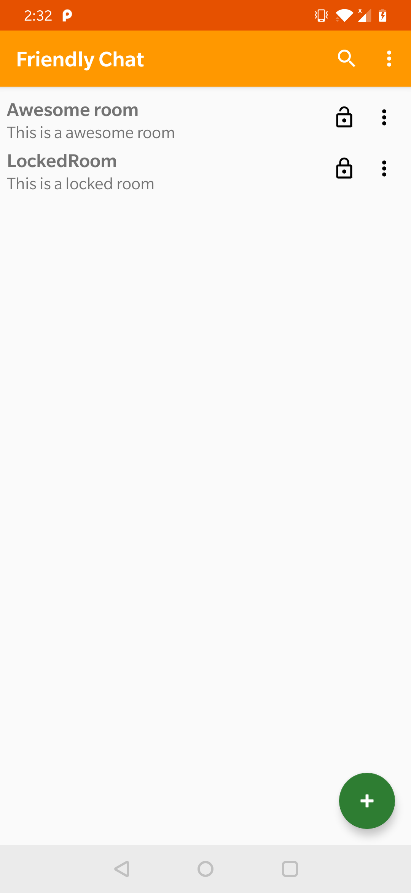

# UdacityFriendlyChat

This repository has the final app of the course **Firebase in a Weekend (Android)** in the udacity website (https://classroom.udacity.com/courses/ud0352) with some changes and additions.

The initial objective of this app was for the user to learn how to use firebase creating a simple app that would open a chat activity after authenticating the user using google or email authentication. After the alterations made the app became more complex and complete, now it allow the users to create and join different chat rooms.

This project can be run either by installing the apk in folder APK or by clonning and setting up the code 

## Setup
To run this project code the user needs:
* Clone the project
* Setup firebase server using the instruction given in [Firebase in a Weekend](https://classroom.udacity.com/courses/ud0352)
* Add google-services.json file given by firebase to folder app

## Changed
* Project changed from java to kotlin
* Changed project architecture MVVM using LiveData in order to facilitate later changes
* Created chat rooms
  * Layout to see the available rooms
  * Dialog to create room
  * Layout to show room info (like name, description and if it has password)
  * Dialog to input password to enter room
  * Search function by room name and description

## To Do
* Allow user to change room information and password
* Allow user to delete their own room
* Detect internet connection
* Improve layouts (especially start activity)
* Allow message edition
* Allow user to change their name in the app
* Create a admin board that only the admin can write messages
* Tests
* Improve documentation

## Screenshots

 
 
Login process: Starts in StartActivity (first activity) when "login" button is pressed, if login is successful then the user goes to the list of chat rooms

 
Create chat room: to create a chat room the must press the + button and a dialog to be filled will appear, at the moment only the room name is needed to be filled the rest is optional 

 
Join room: To join a room the user only need to press the wanted rrom and fill the password if the room is locked

 
 
Chat room: In the chat room the user can see and send different messages
